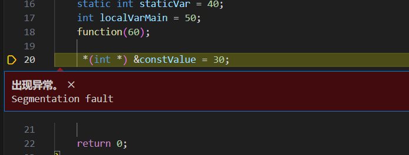
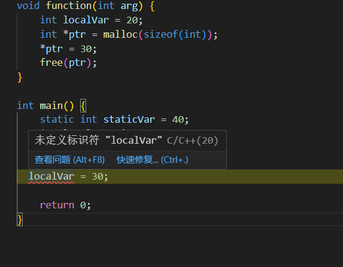

# CS-EASY-03
## Part1 内存模型

#### 内存模型进行概念理解，尝试解释以上分区的具体含义、应用场景和调用方式。

C语言内存模型
在程序运行时，我们输入的数据、程序的中间数据、甚至是程序的命令本身，都是需要有内存去存放以供运行时进行处理的。一个由C/C++编译的程序占用的内存分为栈区(stack)，堆区(heap)，全局区(static)等区域，内存的不同区储存的数据的种类也不相同。具体表示如下：

##### 程序代码区 (code)	                              

具体含义:程序执行代码存放的区域，不可被修改。
应用场景:任何程序的代码都存储在该区域。
调用方式:当程序执行时，处理器从代码区读取指令并执行。

##### 常量区 (constant)	

具体含义:存储常量值(如字符串常量，数值常量等)，这些量在程序运行期间不可被修改，生命周期与程序运行周期一样长。
应用场景:如printf中双引号内的字符串常量
调用方式:可以通过应用常量地址来获得其值，如使用指针指向常量区的字符串。

###### 全局数据区 (global data)	
具体含义:存放全局变量和静态变量，只能被初始化一次，生命周期等于程序运行周期。（通常是用于那些在编译期间就能确定存储大小的变量的存储区）
应用场景:当多个函数需要一个共享数据时；或者静态变量可避免每次调用函数的时候变量被重新初始化
调用方式:全局变量可以通过变量名在整个程序中访问；静态变量可以通过变量名在其对应函数内访问。

###### 堆区 (heap)	
具体含义:由程序员分配内存和释放。
应用场景:当需要存储可变大小的数据结构时，如动态数组，链表等。
调用方式:c语言中使用malloc，calloc，realloc等函数在c区申请内存；使用free函数释放内存。

##### 动态链接库	
具体含义:存放可被多个程序共享的代码和数据。
应用场景:制作大型系统时如果多个程序需要使用相同模块，可以将这些模块封装在动态链接库里。
调用方式:
1，确保有一个已经编译好的动态链接库文件
2，包含必要的头文件（动态链接库中用到的头文件）
3，加载动态链接库（使用 LoadLibrary 函数来加载动态链接库在 (Windows 平台上)；可以使用 dlopen 函数（在 Linux 平台上））
4，获取函数指针(GetProcAddress（在 Windows 平台）或 dlsym（在 Linux 平台））
5，调用函数

##### 栈区 (stack)	

具体含义:由编译器自动分配和释放，其上内容只能在函数范围内存在，函数运行结束的时候自动销毁。
应用场景：如函数内部定义的局部变量
调用方式:临时创建的局部变量和const定义的局部变量，函数的入口参数和返回值

##### 尝试回答下列导学问题：

##### 什么是“栈溢出”？

当程序向栈中存储数据时，超出了栈的存储容量而导致的错误。(如函数无限递归）

##### 堆区和栈区的区别是什么？

1，堆区需要手动申请，栈区由系统自动分配
2，堆区可以存储各种数据类型，栈区存储函数的返回地址，函数参数，局部变量等
3，堆区理论可以分配非常大的内存空间，栈区一般分配小内存空间

##### 程序运行过程中，内存模型当中的哪些区是只读的，哪些区是可读写的？

只读区：代码区，常量区
可读写：堆区，栈区，全局数据区

注意：动态链接库（DLL）中的代码段通常是只读的，而数据段可以是可读写的。
动态链接库在加载到内存后，其代码部分类似于可执行程序的代码区，一般是只读的，以防止被意外修改。而其中的数据部分，比如全局变量等，可以根据具体的使用情况进行读写操作。

##### 如何使用malloc()、free()函数，它们针对的哪一个区进行操作？

###### malloc()函数：
用法：void* malloc(size_t size)。它接受一个参数，表示要分配的内存大小（以字节为单位），返回一个指向分配的内存块的指针。如果分配失败，返回NULL。
eg:int *p=(int*)malloc(sizeof(int)*10)
表示int a[10];
       int *p=a;
###### free()函数：
用法：void free(void* ptr)。它接受一个参数，即要释放的内存块的指针。这个指针必须是之前通过malloc、calloc或realloc等函数分配的内存块的指针
如上面的函数释放，free（p）

它们都针对堆区操作

##### 为什么要对程序使用的内存进行管理？

避免内存泄漏，提高内存利用率
防止悬空指针：当释放一块动态分配的内存后，如果仍然保留指向该内存的指针，就会产生悬空指针。使用悬空指针可能会导致程序出现不可预测的错误。
增强程序的稳定性和可靠性
例如，避免栈溢出、防止访问未初始化的内存等。

## Part 2 内存模型的应用
    #include <stdio.h>
    #include <stdlib.h>

    const int constValue = 100;
    const char* constString = "Hello, World!";
    int globalVar = 10;

    void function(int arg) {
    int localVar = 20;
    int *ptr = malloc(sizeof(int));
    *ptr = 30;
    free(ptr);
    }

    int main() {
    static int staticVar = 40;
    int localVarMain = 50;
    function(60);
    return 0;
    }

小强想知道以下变量或对象的存储区域，请你协助小强完成他的答案，并解释为什么某些变量存储在特定的内存区域：

constValue     常量区  
constString     常量区  
globalVar        全局数据区  
staticVar          全局数据区  
localVar           栈区  
ptr                    栈区  
localVarMain   栈区  

储存在常量区的constValue的值无法被修改

而全局数据区的globalVar和staticVar可以修改  

localVar，ptr ，localVarMain  可以在其所属范围的函数内修改，在其函数范围外修改表现为未定义变量

## Part 3浅谈Cache
##### Cache（缓存）
是计算机体系结构中一个至关重要的组件，它位于CPU和主存（如DRAM）之间，是一种小容量、高速度的存储器，主要由SRAM组成。Cache的主要作用是减少CPU访问主存的次数，从而加快数据访问速度，提升系统整体性能。

##### 什么是冯诺伊曼体系结构？什么是现代计算机的组织结构？这两者的不同点在哪里？

冯诺依曼体系结构：以存储器为中心的计算器模型（原本以运算器为中心），包括运算器，控制器，存储器（以二进制形式存储数据和指令），输入设备，输出设备

现代计算机组织结构：整体保留冯诺依曼体系结构，包括更强大的处理器（处理速度更快），高速存储器（存储数据容量增大，存储速度更快），多样化的输入输出设备，总线结构（提高数据传输效率和可靠性），分布式和并行计算（依靠现代网络提高计算能力和资源利用率）

###### 不同点：
1，性能：冯诺依曼时代的计算机规模大且计算能力远小于现代计算机，现代计算机由于集成电路，固态硬盘和多核处理器的提升，具有更强大的运算速度，处理能力和存储容量。
2，体积：由现代集成电路，中央处理器技术的发展，使得计算机体积大大缩小，同时具有更强大输入输出功能。
3，应用领域：随着网络的发展，现代计算机不仅仅可用于处理计算，还广泛应用在大数据，云计算，人工智能等新兴领域，而冯诺依曼计算机体系主要是为了解决数值运算问题。

##### 主存储器是如何工作的？
主存储器是存储单元的集合，简称内存，由RAM和ROM（制造商写入，用户只读）构成。
从输入设备中读取的程序和数据暂时储存到主存储器中，由CPU提取主存储器中的程序指令、解释指令并执行。

##### 什么是Cache的局部性原理？它包括哪些方面的内容？
Cache依靠局部性原理暂时储存主存中的数据，程序常常会使用集中在一起的局部性数据
局部性包括时间局部性和空间局部性
时间局部性:刚刚操作的数据可能短时间能还会操作（例如for循环中的计步器i）
空间局部性 :刚刚操作的数据可能短时间内还会操作它旁边的数据（例如执行代码时，从上往下依次执行 ）
访问主存的时候会将所访问的那一块数据全部放入Cache中，由于局部性原理，我们认为CPU接下来可能还会操作这些数据，从Cache中直接访问，以提高效率。

##### Cache的运用为什么可以加快系统整体性能？

CPU与内存之间具有主高速缓存和二级缓存等，使用的是SARM，它们能暂时储存内存中读取的数据，CPU会优先访问高速缓存中的数据。如果CPU需要使用同一数据时，从缓存中提起数据的速度要远快与从内存中提取的速度。
内存和磁盘之间也存在磁盘高速缓存。
这些Cache用于弥补不同硬件之间的速度差，以达到加快系统整体性能的目的。

## Part 4 代码优化

以下这段代码是我在做第一节作业时失败的代码
    #include <stdio.h>
    int main() 
    {
        long code;
        int cnt;
    
        for(cnt=1;cnt＞0;cnt++)
        {   
            printf("Show me your code,please.");
            scanf("%ld",&code);
        if(code >= 100000 && code <= 999999)
        {
            printf("I am super hacker!");
            return 0;
        }
        else 
            {printf("Fake code!");
            
            } 
        }
    }
这段代码发生了缓冲区错误导致如果错误输入密码会无限输出Fake code，要求使用本节题目中的知识对源代码进行优化，使得优化后的程序可以在不改变运行结果的情况下提高运行效率与鲁棒性。
    以下是优化后的代码：

    #include <stdio.h>
    #include <stdlib.h>

    int main() {
        long code;
        int inputCorrect = 0;
    while (!inputCorrect) {
        printf("Show me your code,please.\n");
        if (scanf("%ld", &code)!= 1) {
            // 处理输入错误，清除输入缓冲区
            int c;
            while ((c = getchar())!= '\n' && c!= EOF);
            printf("Invalid input. Please try again.\n");
            continue;
        }
        if (code >= 100000 && code <= 999999) {
            printf("I am super hacker!\n");
            inputCorrect = 1;
        } else {
            printf("Fake code!\n");
        }
    }
    return 0;
    }
优化说明：
用while循环结合标志变量inputCorrect替代原来的for循环，这样可以更灵活地控制循环的结束条件，避免可能出现的无限循环导致的 “爆栈” 风险。
在scanf读取输入后，检查返回值以确保输入成功。如果输入错误，使用while ((c = getchar())!= '\n' && c!= EOF);清除输入缓冲区中的错误输入，然后提示用户重新输入，增强了程序的鲁棒性。
